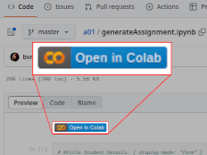
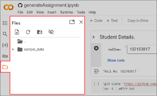
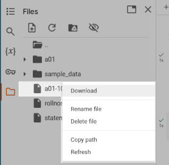

<!--  -->

{ .tiet-logo }

**UTA027: Artificial Intelligence**  
**TIET Patiala**

# A01: Predicate Calculus

**Instructors**:

1. Raghav B. Venkataramaiyer (`bv.raghav`)
2. Stuti Chug (`stuti.chug`)

## Task ##

This exercise requires a student to translate
situations (decision logic) described in natural
english language to be translated to predicate
calculus.  Here are a few [examples](#examples).  There
are a total of 75 instances for each student.  The
submission is in the form of a git repository the
commit access to which shall be rescinded after the
deadline.

### Important Dates ###

| S.No. | Desc              | Timestamp           |
|-------|-------------------|---------------------|
| 1.    | Submission Starts | 07-01-2025 0800 IST |
| 2.    | Submission Ends   | 20-01-2025 0500 IST |

### Getting started ###

This assignment should already be available on your
userspace as a git repository.  Navigate to the git
repository in your userspace;

1. Navigate to `generateAssignment.ipynb`, (in your userspace).
2. Click “Open in Colab.”  
   
3. Upon opening in Colab; the runtime should connect
   all by itself and the files pane should be
   populated. Click on folder/ files icon to view.  
   
4. Fill you `rollno` in the widget; and `Ctrl+F9` (or
   else, via Menu  ⧽  Runtime  ⧽  Run all).  This
   should result in a CSV file named
   `a01-<YOUR_ROLL_NO>.csv` in the files
   pane.  Click on three-dots to download it.  
   
5. **Edit the csv with your favourite spreadsheet
   editor** (Google Sheets, MS Excel, LibreOffice, VIm,
   Emacs or otherwise) **to fill in your answers**.
6. Save or download the file as CSV, and **commit back
   into your repository**.
7. A submission may be updated multiple times before
   the deadline.  So, one may save the progress online.
   By default a student assignment is a private repo;
   so unless exposed intentionally by the student, your
   submission is secure.

### Some Tricks ###
In your lab session, your instructor may be able to
guide to use save some time by:

1. Getting started with the Github Classrooms;
2. Save the file to google drive directly instead of
   downloading;
2. Editing within Github Codespace itself;
2. Using automated string substitution(s), *e.g.*  
   `FA X tomorrow?(X) AND rains?(X) IMPL
   bring?(me,umbrella)`  
   instead of  
   `∀ X tomorrow?(X) ∧ rains?(X) → bring?(me,umbrella)`  
   and this translation is done automatically.

## Examples ##

A situation description in natural language, may be
expressed formally using predicate logic.  The
following ten cases serve as exemplars.

=== "Case 1"

    *If it rains tomorrow, I'll bring an umbrella.*

    `∀ X tomorrow?(X) ∧ rains?(X) → bring?(me,umbrella)`

    Here, `X` is a variable chosen for day, and we know
    that there are two predicates for the day, that
    define it; namely its `tomorrow?`, and it `rains?`
    on the day.  This forms our premise (or antecedent).
    The consequent is that I (represented by a constant
    `me` because `i` might be too generic) would bear an
    umbrella.
 

=== "Case 2"

    *If you heat water to 100°C, it boils.*

    `∀ T geq?(temp(water, T),100) → boils?(water,T)`

    From our understanding of the world, heating of
    water is a process, which bears its signature as
    water temperature.  Hence the author chose a
    function `temp` to extract the substance property at
    time `T`.  Function Expression `temp(water,T)`
    represents that water temperature is being measured,
    probably periodically through some sensor.  `geq?`
    is a predicate defined for comparison, and returns
    “truthy” if the first argument is greater than or
    equal to the second.  `boils?` is a (predicate)
    property that will be visible on water at time `T`
    as a consequence.
 

=== "Case 3"

    *If I had more time, I would learn to play piano.*

    `∀ X greater?(free_time(me),X) → learning_piano?(me)`

    More time is a relative concept; hence the reference
    point here is taken as a variable `X`, to define the
    premise.  And the nomenclature `learning_piano?` for
    the predicate has been designed to reflect continuity.

    Please note here that in the formulation here the
    english grammatical tense makes no difference,
    e.g. “If I am having more time, I am learning piano”
    might be poor, perhaps incorrect, english but that’s
    the rough meaning of this well-formed expression
    (WFE) in predicate calculus (PC).
 

=== "Case 4"

    *If she arrives early, we can start the meeting sooner.*

    `∀ X less?(arr_time(she),X) → less?(start_time(meeting),X)`

    Again here, understanding the world of discourse
    would help frame a (WFE-PC)

    Time is taken as variable and subtly embedded as
    “return value” of a “function”.
 

=== "Case 5"

    *If you mix blue and yellow, you get green.*

    `∀ X blue?(X) ∧ ∀ Y yellow?(Y) → green?(mix(X,Y))`

    `X` and `Y` have been chosen as variable colours,
    because blue (or yellow or green) is not just one
    colour, they are a range of colours. eg. both sky
    and sea are blue, but not same.  And if you mix
    either of them with *a yellow*, you get *a green*.
 

=== "Case 6"

    *If I were you, I'd take that job offer.*

    `as_if?(me,you) → ∀ X (job_offer?(X) ∧
    accept?(me,X))`
 

=== "Case 7"

    *If the store is open, could you buy some milk?*

    `open?(store) → ∀ X may_buy_from?(you,store,milk)`

    The question like “could you…?” is implicit in all
    of *PC*, because the expression evaluates to true
    only if certain conditions are met.  So, in *PC*,
    this english sentence is equivalent to saying “If
    the store is open, by me some milk.”
 

=== "Case 8"

    *If my dog hears a noise, he always barks.*

    `∀ X noise?(X) ∧ ∀ Y my_dog?(Y) ∧ hears?(X,Y) →
    barks?(Y)`  
    or,  
    `∀ X noise?(X) ∧ ∀ Y dog?(Y) ∧ pet?(me, Y) ∧
    hears?(X,Y) → barks?(Y)`

    Please note the equivalence here: `my_dog?(Y) ≡
    dog?(Y) ∧ pet?(me, Y)`
 

=== "Case 9"

    *If we leave now, we'll catch the train.*

    `eq?(dep_time(us),now()) → catch?(us,train)`  
    or,  
    `∀T now?(T) ∧ eq?(dep_time(us),T) → catch?(us,train)`

    `now()` has essentially been represented, more
    formally in the latter version, as a “unary
    function” because it’s value changes depending upon
    the time of invocation.
 

=== "Case 10"

    *If you need help, just ask me.*

    `need?(you,help) → ask?(you,me,help)`

*[PC]: Predicate Calculus
*[WFE]: Well-Formed Expression
